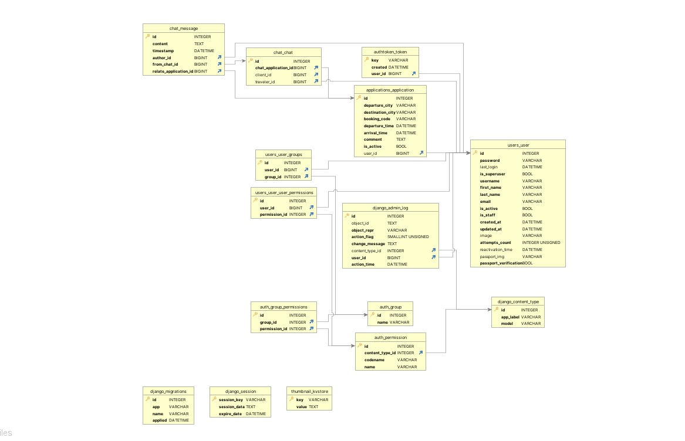
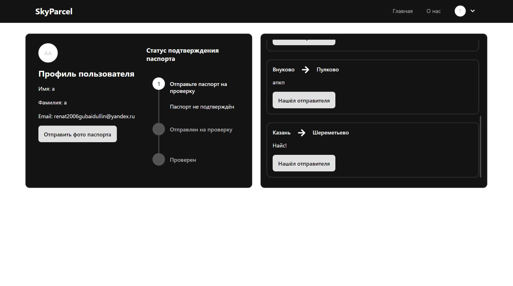
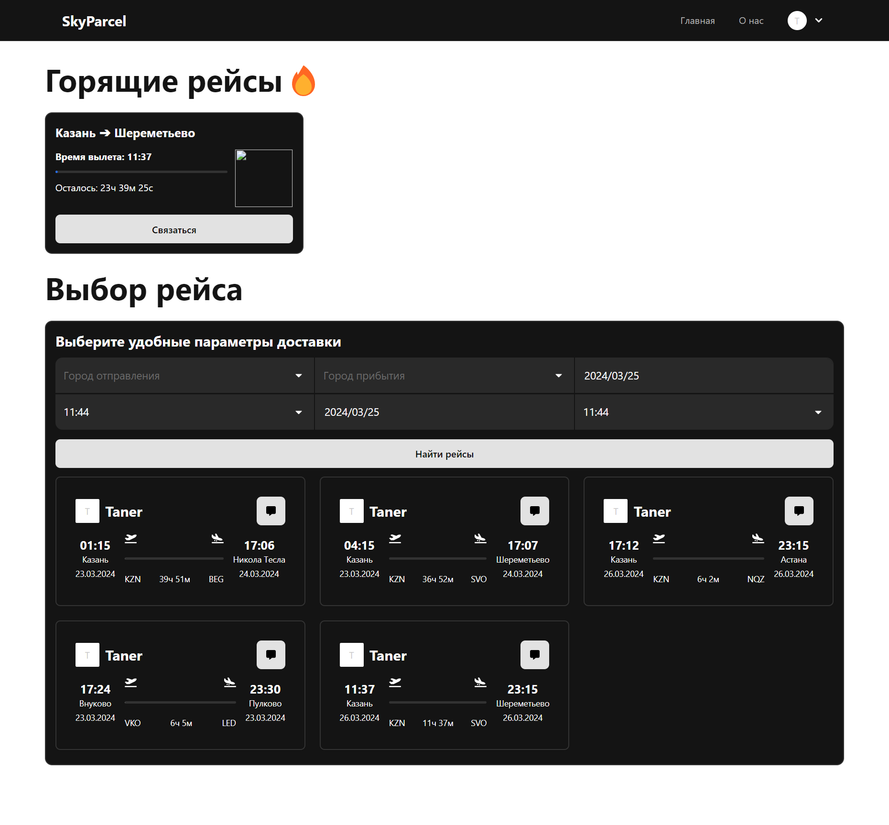
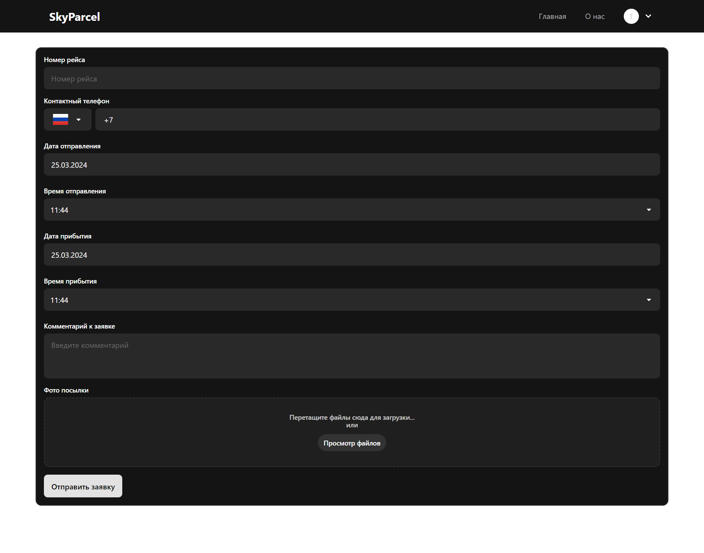

# SkyParcel


# Технологии

Python 
Django 
REACT
Node.js

# Установка


1. Клонировать репозиторий:

   ```shell
      git clone https://gitlab.crja72.ru/django_2023/projects/sky-parcel_express.git
   ```
2. Создать виртуальное окружение:

   ```shell
      python -m venv venv
      venv\Scripts\activate.bat
   ```
   
3. Установить зависимости

   ```shell
       
    * dev:
       pip install -r requirements/dev.txt

    * test:
       pip install -r requirements/test.txt
   ```
   
4. Перейти в папку skyparcel

   ```shell
      cd skyparcel
   ```

5. Миграции

   ```shell
      python manage.py migrate
   ```

6. Запуск

   ```shell
      python manage.py runserver
   ```
   
7. ER базы данных
   
     
8. Профиль пользователя
      
9. Главаная страница
      
10. Добавление заявки
      
